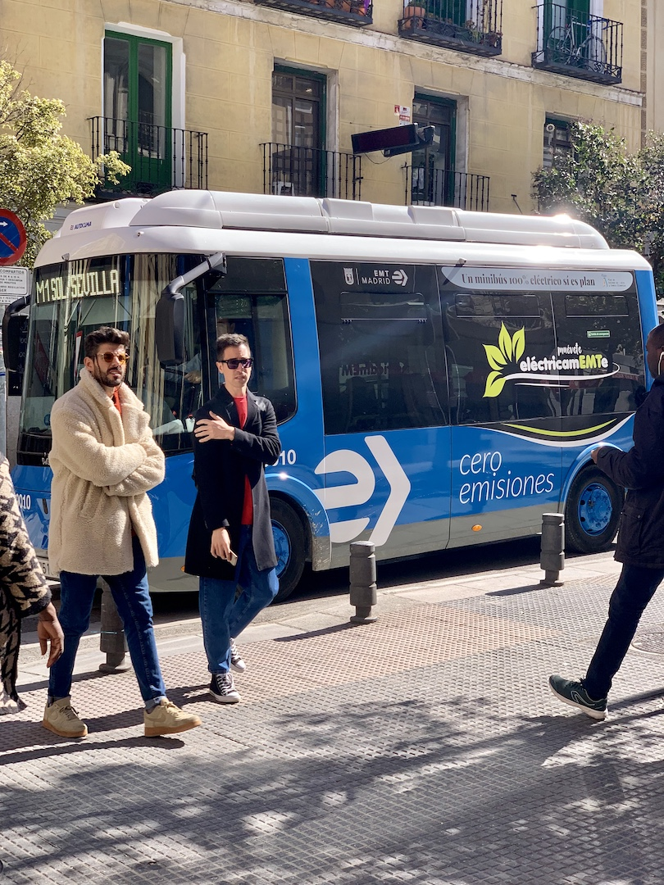
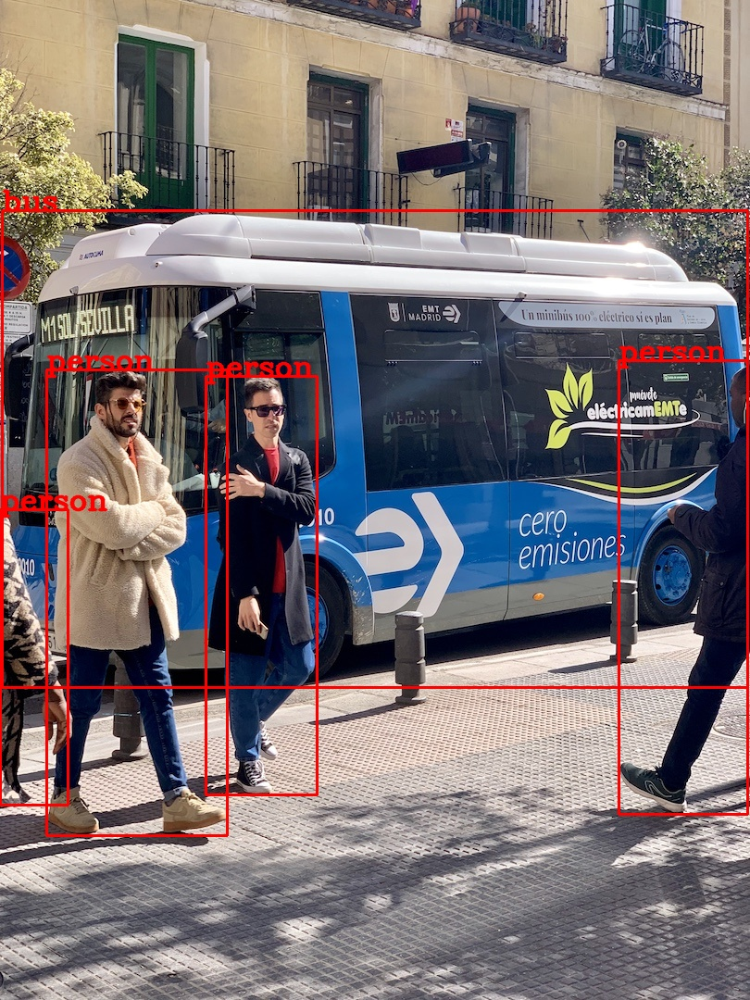

# YOLOv8 Object Detection Example

## Build and Run

1. Adjust foreign imports in [opencvbinding.odin](./opencvbinding.odin) and [onnxbinding.odin](./onnxbinding.odin)

2. Build static or shared library to interact with OpenCV
```bash
cd thirdparty/opencv
make static
```

3. Build and run example
```bash
make run
```

## Results

<center>
    
    
</center>

## References
- https://github.com/ultralytics/ultralytics/tree/main/examples/YOLOv8-CPP-Inference
- https://github.com/ultralytics/ultralytics/tree/main/examples/YOLOv8-ONNXRuntime-CPP
- https://github.com/TDiblik/rust-ort-opencv-yolov8-example/blob/master/src/main.rs
- https://answers.opencv.org/question/176828/how-to-extract-2d-mat-from-a-4d-mat/
- https://riptutorial.com/opencv/example/9922/efficient-pixel-access-using-cv--mat--ptr-t--pointer